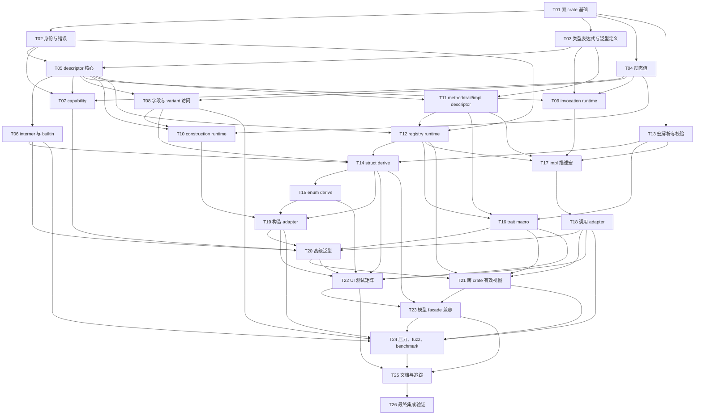

# `qubit-reflect` 实施计划

> **历史实施基线（已完成）：** 本文保留最初的任务分解、红—绿步骤和验收依据，不再作为当前待办清单，也不应重新执行其中的临时工作区或 Git 操作。当前架构以[中文详细设计](2026-08-29-qubit-reflect-design.zh_CN.md)与 [English design](2026-09-01-qubit-reflect-design.md) 为准；完成度证据以[需求追踪矩阵](2026-08-29-qubit-reflect-requirements-traceability.zh_CN.md)和仓库 CI 为准。

> **面向智能体执行者：** 必须使用 superpowers:subagent-driven-development（推荐）或 superpowers:executing-plans，逐项实施本计划。各步骤使用复选框（`- [ ]`）语法跟踪进度。

**目标：** 按最终需求规范实现完整、业务无关、安全且可跨 crate 汇聚的 `qubit-reflect` runtime 与三个过程宏，并为后续 `rs-model-*` 重构提供通用反射底座。

**架构：** 仓库采用 `qubit-reflect` runtime 与 `qubit-reflect-derive` 两个 crate；runtime 以唯一根 descriptor、mode 泛型动态值、惰性 interner 和冻结 registry 为核心，derive 生成安全 adapter 与 `inventory` 静态片段。所有模型概念留在下游，依赖方向始终为 `rs-model-* -> qubit-reflect`。

**技术栈：** Rust 2024、MSRV 1.94、`std`、`inventory`、`thiserror`、`syn`、`quote`、`proc-macro2`、`proc-macro-crate`、`trybuild`、Cargo workspace。

**Temporary Workspace:** `/tmp/superpowers-rs-reflect-plan.VBOYaJ`

**临时工作区清理：** 执行期间必须保留该工作区，直至任务成功完成。成功后，仅在完成相同的路径组件验证后才能删除；不得使用字符串前缀判断包含关系。必须确认：解析后的工作区不是解析后的临时根目录；其解析后的父目录与临时根目录完全相同；其目录名以 `superpowers-` 开头；`.superpowers-session` 是空的、非符号链接的普通文件。如果执行时存在当前仓库，还必须证明工作区与仓库完全双向不重叠：任一路径都不等于另一路径，也不包含另一路径。否则，应记录未检测到当前仓库，并继续完成其余验证。

## 全局约束

- 事实来源依次为[最终需求规范](2026-08-28-qubit-reflect-requirements.zh_CN.md)和[详细设计](2026-08-29-qubit-reflect-design.zh_CN.md)；发生冲突时停止实现并先修订文档。
- 全仓库使用 Rust 2024，`rust-version = "1.94"`，依赖 `std`，不实现 `no_std`。
- runtime、derive 生成代码和测试辅助实现保持 `#![forbid(unsafe_code)]`；第三方 unsafe 只能通过安全 API 使用。
- `qubit-reflect`、`qubit-reflect-derive` 不得依赖任何 `rs-model-*` 或 `qubit-spi` crate。
- 根 crate 默认 feature 为 `derive`；关闭默认 feature 时 runtime 必须独立编译和测试。
- `qubit-reflect-derive` 不依赖 runtime，生成路径统一通过 facade 的 `__private` 协议。
- 所有可在宏输入内证明的错误必须成为编译错误；跨 fragment 冲突和动态值错误使用结构化 runtime error。
- 不增加第二个公共 value trait，不自动 opaque，不通过运行时 capability 增加 `Send`/`Sync`。
- 每个行为任务遵循红—绿—重构：先写失败测试，确认预期失败，再写最小完整实现并运行 focused test。
- 未经用户另行授权，不执行 `git add`、`git commit` 或 `git push`。每个任务只运行 `git diff --check` 并记录建议提交信息。
- 不顺手修改 README、CI 或其他 Qubit crate；只有本计划明确列出的集成任务可以更新这些文件。
- 每次开始修改 Rust 源码前，按任务需要读取 `~/.agents/specs/rust-coding.mdc`；涉及公共注释或测试时再分别读取
  `~/.agents/specs/rust-comment.mdc`、`~/.agents/specs/rust-test.mdc`，不得遍历无关规则。

---

## 计划文件结构

```text
rs-reflect/
├── Cargo.toml
├── src/
│   ├── lib.rs
│   ├── identity/
│   ├── expression/
│   ├── descriptor/
│   ├── capability/
│   ├── value/
│   ├── access/
│   ├── invoke/
│   ├── construct/
│   ├── registry/
│   ├── builtin/
│   ├── error/
│   └── private/
├── derive/
│   ├── Cargo.toml
│   └── src/{parse,ir,validate,expand}/
├── tests/
│   ├── mod.rs
│   ├── descriptor/
│   ├── value/
│   ├── access/
│   ├── invoke/
│   ├── construct/
│   ├── registry/
│   └── ui/{pass,fail}/
├── test-crates/
│   ├── registry-types/
│   ├── registry-impl-a/
│   ├── registry-impl-b/
│   ├── registry-app/
│   ├── model-facade-runtime/
│   ├── model-facade-derive/
│   └── model-facade-app/
├── benches/
├── fuzz/
└── doc/
```

## 调度图（必填）

| 任务 | 前置任务 | 最小解锁产物 | 写入集合 | 本地验证 | 集成验证归属 | 审查时机 |
| --- | --- | --- | --- | --- | --- | --- |
| T01 | 无 | 双 crate workspace、feature matrix、模块与测试入口可编译 | `Cargo.toml`、`derive/**` 基础入口、`src/lib.rs`、`src/*/mod.rs`、`tests/**` 空测试模块 | `cargo check --workspace --all-targets` | T26 | 立即审查 |
| T02 | T01 | 身份、名称、可见性、源码位置和基础错误类型 | `src/identity/**`、`src/error/**`、`tests/descriptor/identity_tests.rs` | `cargo test -p qubit-reflect --test integration_tests identity` | T26 | 立即审查 |
| T03 | T01 | `TypeExpression`、lifetime、generic definition 公共模型 | `src/expression/**`、`tests/descriptor/expression_tests.rs` | `cargo test -p qubit-reflect --test integration_tests expression` | T26 | 立即审查 |
| T04 | T01 | Local/ThreadSafe 动态值、Any、str、downcast | `src/value/**`、`tests/value/**` | `cargo test -p qubit-reflect --test integration_tests value` | T26 | 立即审查 |
| T05 | T02、T03 | descriptor 根模型、kind typed view、`TypeRef` | `src/descriptor/**`、`tests/descriptor/type_descriptor_tests.rs` | `cargo test -p qubit-reflect --test integration_tests type_descriptor` | T26 | 立即审查 |
| T06 | T05 | interner、primitive/text/container/pointer builtin | `src/registry/interner.rs`、`src/builtin/**`、`tests/descriptor/builtin_tests.rs` | `cargo test -p qubit-reflect --test integration_tests builtin` | T26 | 立即审查 |
| T07 | T02、T04、T05 | 类型化 capability 与显式 concrete capability 登记 | `src/capability/**`、`tests/descriptor/capability_tests.rs` | `cargo test -p qubit-reflect --test integration_tests capability` | T26 | 立即审查 |
| T08 | T04、T05 | 字段/variant descriptor 和安全访问 runtime | `src/access/**`、`src/descriptor/{field_descriptor,variant_descriptor}.rs`、`tests/access/**` | `cargo test -p qubit-reflect --test integration_tests access` | T26 | 立即审查 |
| T09 | T03、T04、T05 | invocation 输入、输出、receiver、future、recovery runtime | `src/invoke/**`、`tests/invoke/runtime_tests.rs` | `cargo test -p qubit-reflect --test integration_tests invocation_runtime` | T26 | 立即审查 |
| T10 | T04、T05、T08 | struct/variant/update 构造 runtime | `src/construct/**`、`tests/construct/runtime_tests.rs` | `cargo test -p qubit-reflect --test integration_tests construction_runtime` | T26 | 立即审查 |
| T11 | T03、T05 | method、trait、impl、关联项和 applied trait descriptor | `src/descriptor/{method_descriptor,trait_descriptor,impl_descriptor}.rs`、`tests/descriptor/trait_tests.rs` | `cargo test -p qubit-reflect --test integration_tests trait_descriptor` | T26 | 立即审查 |
| T12 | T02、T05、T11 | `inventory` fragment、冻结 registry、确定性索引 | `src/registry/{fragment,builder,indexes,registry}.rs`、`src/private/**`、`tests/registry/runtime_tests.rs` | `cargo test -p qubit-reflect --test integration_tests registry_runtime` | T21、T26 | 立即审查 |
| T13 | T01 | derive parse/IR/validate 与聚合诊断 | `derive/src/{parse,ir,validate}/**`、`derive/src/lib.rs`、`derive/tests/**` | `cargo test -p qubit-reflect-derive` | T22、T26 | 立即审查 |
| T14 | T06、T08、T12、T13 | struct `Reflect` derive、字段访问、注册片段 | `derive/src/expand/{mod,structs}.rs`、`tests/descriptor/derive_struct_tests.rs` | `cargo test -p qubit-reflect --test integration_tests derive_struct` | T22、T26 | 立即审查 |
| T15 | T14 | enum derive、variant、discriminant 与构造描述 | `derive/src/expand/enums.rs`、`tests/descriptor/derive_enum_tests.rs` | `cargo test -p qubit-reflect --test integration_tests derive_enum` | T22、T26 | 批量审查 |
| T16 | T11、T12、T13 | `#[reflect]` trait、marker、隐藏 hook | `derive/src/expand/traits.rs`、`tests/descriptor/reflect_trait_tests.rs` | `cargo test -p qubit-reflect --test integration_tests reflect_trait` | T21、T22、T26 | 立即审查 |
| T17 | T09、T11、T12、T13 | `#[reflect_impl]` 描述、external trait、方法实例 | `derive/src/expand/impls.rs`、`tests/descriptor/reflect_impl_tests.rs` | `cargo test -p qubit-reflect --test integration_tests reflect_impl` | T18、T21、T22、T26 | 立即审查 |
| T18 | T17 | 动态方法 adapter、panic、async、receiver、borrow origin | `derive/src/expand/impls.rs`、`tests/invoke/adapter_tests.rs` | `cargo test -p qubit-reflect --test integration_tests invocation_adapter` | T21、T22、T26 | 立即审查 |
| T19 | T10、T14、T15 | struct/variant/update 生成 adapter 与 recovery | `derive/src/expand/construction.rs`、`tests/construct/adapter_tests.rs` | `cargo test -p qubit-reflect --test integration_tests construction_adapter` | T22、T26 | 立即审查 |
| T20 | T06、T07、T16、T18、T19 | generic concrete、specialization、HRTB、关联项解析 | `src/descriptor/generic_descriptor.rs`、`derive/src/expand/generics.rs`、`tests/descriptor/generic_tests.rs` | `cargo test -p qubit-reflect --test integration_tests generic` | T21、T22、T26 | 立即审查 |
| T21 | T12、T16、T18、T20 | 跨 crate 汇聚和 trait 有效方法视图 | `test-crates/registry-*/**`、`tests/registry/cross_crate_tests.rs`、`src/registry/effective_type_view.rs` | `cargo test -p registry-app` | T26 | 立即审查 |
| T22 | T14、T15、T16、T18、T19、T20 | 完整 compile-pass/fail 属性与安全边界矩阵 | `tests/ui/**`、`tests/ui_tests.rs`、`Cargo.toml` UI test 入口 | `TRYBUILD=overwrite cargo test -p qubit-reflect --test ui_tests` 后再次无 overwrite 运行 | T26 | 批量审查 |
| T23 | T14、T21、T22 | 无真实模型依赖的 facade 委托兼容夹具 | `test-crates/model-facade-{runtime,derive,app}/**`、`tests/registry/model_facade_tests.rs` | `cargo test -p model-facade-app` | T26 | 立即审查 |
| T24 | T06、T08、T18、T19、T21、T23 | benchmark、fuzz、并发与析构压力验证 | `benches/**`、`fuzz/**`、`tests/registry/stress_tests.rs`、`Cargo.toml` bench | `cargo test -p qubit-reflect --test integration_tests stress`、`cargo bench --no-run` | T26 | 批量审查 |
| T25 | T22、T23、T24 | 公共重导出、Rustdoc、用户指南、284 条追踪矩阵 | `src/lib.rs`、`README*`、`doc/*guide*`、`doc/*traceability*` | `cargo doc --workspace --all-features --no-deps` | T26 | 立即审查 |
| T26 | T25 | 全 feature/platform/package 验收结果 | CI 配置仅在发现缺口时按本任务精确修改；通常无代码写入 | `./ci-check.sh`、feature matrix、package、cross-crate tests | T26 | 立即审查 |

并行批次：T02/T03/T04/T13 可在 T01 后并行；T06/T07/T08/T09/T11 在各自前置完成后写入集合互不相交，可并行；
T16 与 T17 可并行。T22、T23、T24 都会修改根 `Cargo.toml`，因此按该顺序串行执行。所有共享 `target/` 的重型 Cargo 命令属于资源组 `cargo-target`，
同一工作区中串行执行；只有 T26 运行完整 CI、Clippy、Rustdoc 和 package 验证。

## 任务拓扑依赖图（必填）



## 任务列表

### T01：建立双 crate workspace 与测试骨架

**文件：**
- 修改：`Cargo.toml`
- 修改：`src/lib.rs`
- 新建：`src/{identity,expression,descriptor,capability,value,access,invoke,construct,registry,builtin,error,private}/mod.rs`
- 新建：`derive/Cargo.toml`
- 新建：`derive/src/lib.rs`
- 新建：`tests/mod.rs`
- 新建：计划文件结构中 T02—T21/T24 使用的各测试分类 `mod.rs` 和空测试源文件

**接口：**
- 输入依赖：无。
- 输出接口：Cargo packages `qubit-reflect`、`qubit-reflect-derive`；根 feature `derive`；三个宏的初始拒绝入口只接受输入并返回明确编译诊断，尚不伪造功能。

**调度：**
- 前置任务与最小解锁产物：无。
- 写入集合：仅本任务文件。
- 本地验证：`cargo check --workspace --all-targets`。
- 集成验证：T26。
- 审查时机：立即审查。

- [ ] **步骤 1：写 workspace metadata 测试**

在 `tests/mod.rs` 建立统一集成测试入口；预先建立并声明后续任务的空测试模块，使 T02/T03/T04 等任务只写各自文件，
不并发修改共享 `mod.rs`。在根清单中声明：

```toml
[workspace]
members = [".", "derive"]
resolver = "3"

[features]
default = ["derive"]
derive = ["dep:qubit-reflect-derive"]

[dependencies]
inventory = "0.3"
thiserror = "2"
qubit-reflect-derive = { version = "=0.1.0", path = "derive", optional = true }

[[test]]
name = "integration_tests"
path = "tests/mod.rs"
```

- [ ] **步骤 2：确认当前单 crate scaffold 不能满足 workspace 检查**

运行：`cargo metadata --format-version 1 --no-deps`

预期：输出中只有 `qubit-reflect`，不存在 `qubit-reflect-derive`，据此确认测试前状态。

- [ ] **步骤 3：实现双 crate 与 facade 重导出**

`derive/Cargo.toml` 使用 `proc-macro = true`，依赖 `syn` full/extra-traits、`quote`、`proc-macro2`、`proc-macro-crate`。
`src/lib.rs` 保持 `#![forbid(unsafe_code)]`，加入：

```rust,ignore
#[cfg(feature = "derive")]
pub use qubit_reflect_derive::{Reflect, reflect, reflect_impl};

#[doc(hidden)]
#[path = "private/mod.rs"]
pub mod __private;
```

`src/private/mod.rs` 重导出 `inventory`。同时在 `src/lib.rs` 声明其余十一个顶层模块；每个初始 `mod.rs` 只包含模块级
Rustdoc，实际子模块由对应任务加入。

derive 的三个入口在尚未实现时返回指向宏名的 `compile_error!`，避免静默接受输入。
根 package 移除 scaffold 的 `publish = false`；两个 crate 使用相同版本并具备独立打包 metadata。

- [ ] **步骤 4：验证 feature matrix 基础编译**

运行：

```bash
cargo check --workspace --all-targets
cargo check -p qubit-reflect --no-default-features
cargo check -p qubit-reflect --all-features
```

预期：三个命令退出码均为 0；metadata 包含两个 package；derive 不依赖 runtime。

- [ ] **步骤 5：版本控制检查点**

运行：`git diff --check`

预期：无空白错误。建议提交信息：`build: establish reflect workspace`。未获授权时不执行提交。

### T02：实现身份、名称、可见性与基础错误

**文件：**
- 新建：`src/identity/mod.rs`
- 新建：`src/identity/{capability_id,external_trait_id,member_id,fragment_id,visibility}.rs`
- 新建：`src/error/mod.rs`
- 新建：`src/error/{id_error,registry_error,type_mismatch}.rs`
- 修改：`tests/descriptor/identity_tests.rs`
- 修改：`tests/mod.rs`

**接口：**
- 输入依赖：T01 的 runtime crate。
- 输出接口：`CapabilityId`、`ExternalTraitId`、`MemberId`、`FragmentIdentity`、`Visibility`、`RegistryError`、`TypeMismatch`。

**调度：** 前置 T01；写入仅 `identity/error` 和对应测试；focused command 为 `cargo test -p qubit-reflect --test integration_tests identity`；T26 集成；立即审查。

- [ ] **步骤 1：编写失败测试**

覆盖合法命名空间 ID、空段/首尾点号、`qubit.reflect.*` 第三方冲突、成员复合身份、visibility 归一化、registry error clone：

```rust,ignore
assert!(CapabilityId::new("example.fixture.clone").is_ok());
assert!(CapabilityId::new("example..clone").is_err());
assert_eq!(Visibility::Private, Visibility::from_source("pub(self)"));
let cloned = RegistryError::duplicate_fragment(left, right).clone();
assert_eq!(error.kind(), cloned.kind());
```

- [ ] **步骤 2：运行测试确认缺少类型**

运行：`cargo test -p qubit-reflect --test integration_tests identity`

预期：编译失败，提示身份和错误类型未定义。

- [ ] **步骤 3：实现不可变身份值与错误数据**

使用私有 `Box<str>` 保存验证后的稳定 ID；`RegistryError` 使用 `Arc<RegistryErrorData>`：

```rust,ignore
#[derive(Clone, Debug, Eq, Hash, PartialEq)]
pub struct CapabilityId(Box<str>);

#[derive(Clone, Debug)]
pub struct RegistryError(Arc<RegistryErrorData>);

#[derive(Clone, Copy, Debug, Eq, Hash, PartialEq)]
pub enum VisibilityKind {
    Public,
    Crate,
    Super,
    Restricted,
    Private,
}
```

ID validator 只接受点号分隔的 ASCII identifier 段；保留命名空间检查通过构造入口的 `IdAuthority` 区分 core 与 external。

- [ ] **步骤 4：运行 focused tests**

运行：`cargo test -p qubit-reflect --test integration_tests identity`

预期：身份、可见性和错误测试全部通过。

- [ ] **步骤 5：版本控制检查点**

运行 `git diff --check`；建议提交信息：`feat: add reflection identities and base errors`；不执行未授权 Git 写操作。

### T03：实现类型表达式、生命周期与泛型定义

**文件：**
- 新建：`src/expression/mod.rs`
- 新建：`src/expression/{type_expression,lifetime_expression,generic_definition,generic_argument,predicate}.rs`
- 修改：`tests/descriptor/expression_tests.rs`
- 修改：`tests/mod.rs`

**接口：**
- 输入依赖：T01。
- 输出接口：`TypeExpression`、`LifetimeExpression`、`GenericDefinitionDescriptor`、`GenericParameterDescriptor`、`GenericArgument`、`PredicateDescriptor`。

**调度：** 前置 T01；写入 `expression`；本地验证 `cargo test -p qubit-reflect --test integration_tests expression`；T26 集成；立即审查。

- [ ] **步骤 1：编写结构导航测试**

构造并断言 `&'a mut [T]`、`fn(&T) -> impl Iterator<Item = T>`、HRTB、const generic 和 never 的结构树；验证 Debug 不依赖 `syn`。

- [ ] **步骤 2：运行并确认类型缺失失败**

运行 focused command，预期编译错误指向 `TypeExpression` 未定义。

- [ ] **步骤 3：实现封闭、可导航的表达式枚举**

核心接口固定为：

```rust,ignore
pub enum TypeExpression {
    Concrete(ConcreteTypeExpression),
    Parameter(Box<str>),
    SelfType,
    Associated(AssociatedTypeExpression),
    Reference(ReferenceTypeExpression),
    RawPointer(RawPointerTypeExpression),
    Slice(Box<TypeExpression>),
    Array(ArrayTypeExpression),
    Tuple(Box<[TypeExpression]>),
    FunctionPointer(FunctionPointerExpression),
    TraitObject(TraitObjectExpression),
    Opaque(OpaqueTypeExpression),
    Never,
}
```

所有集合保存声明顺序的 boxed slice；诊断文本为独立可选字段，不参与 Eq/Hash 身份。

- [ ] **步骤 4：运行表达式测试与 Rustdoc**

运行：`cargo test -p qubit-reflect --test integration_tests expression && cargo doc -p qubit-reflect --no-deps`

预期：测试和 Rustdoc 均成功，无公开 `syn` 类型。

- [ ] **步骤 5：版本控制检查点**

运行 `git diff --check`；建议提交信息：`feat: model Rust type and generic expressions`。

### T04：实现 Local/ThreadSafe 动态值边界

**文件：**
- 新建：`src/value/{mod,mode,dynamic_ref,dynamic_mut,dynamic_owned,storage}.rs`
- 修改：`tests/value/{mod,dynamic_ref_tests,dynamic_owned_tests,thread_mode_tests,str_tests}.rs`
- 修改：`tests/mod.rs`

**接口：**
- 输入依赖：T01。
- 输出接口：`DynamicRef<'a, M>`、`DynamicMut<'a, M>`、`DynamicOwned<M>`、`Local`、`ThreadSafe` 及六个公共别名。

**调度：** 前置 T01；写入 `value`；本地验证 `cargo test -p qubit-reflect --test integration_tests value`；T26 集成；立即审查。

- [ ] **步骤 1：编写 downcast、生命周期和线程性质测试**

runtime tests 覆盖 owned downcast 失败返还原包装、borrow downcast 不改状态、`str` 专用入口和 `into_local`。UI compile-fail 样例先放入本任务测试模块的 doctest，T22 再迁移到 trybuild。

- [ ] **步骤 2：运行并确认包装类型不存在**

运行 focused command，预期编译失败。

- [ ] **步骤 3：实现 sealed mode 与三类存储**

公共构造 bound 必须精确为：

```rust,ignore
impl DynamicOwned<Local> {
    pub fn new<T: 'static>(value: T) -> Self;
}

impl DynamicOwned<ThreadSafe> {
    pub fn new<T: 'static + Send + Sync>(value: T) -> Self;
    pub fn into_local(self) -> DynamicOwned<Local>;
}

impl<'a> DynamicRef<'a, ThreadSafe> {
    pub fn new<T: 'static + Sync>(value: &'a T) -> Self;
}

impl<'a> DynamicMut<'a, ThreadSafe> {
    pub fn new<T: 'static + Send + Sync>(value: &'a mut T) -> Self;
}
```

内部 storage 使用 Local `dyn Any` 与 ThreadSafe `dyn Any + Send + Sync`，`str` 使用不伪装成 Any 的专用 variant。

- [ ] **步骤 4：运行动态值测试**

运行 focused command，预期全部通过；再运行 `cargo check -p qubit-reflect --no-default-features`。

- [ ] **步骤 5：版本控制检查点**

运行 `git diff --check`；建议提交信息：`feat: add safe dynamic value modes`。

### T05：实现 descriptor 根模型与 typed view

**文件：**
- 新建或完善：`src/descriptor/{mod,type_descriptor,type_kind,type_ref,typed_view,field_descriptor,variant_descriptor,method_descriptor,trait_descriptor,impl_descriptor,generic_descriptor}.rs`
- 修改：`tests/descriptor/type_descriptor_tests.rs`

**接口：**
- 输入依赖：T02 身份、T03 表达式。
- 输出接口：`Reflect`、`TypeDescriptor`、`TypeKind`、`StructKind`、`TypeRef`、`OpaqueTypeDescriptor` 及 typed views。

**调度：** 前置 T02/T03；写入 `descriptor`；focused test `type_descriptor`；T26 集成；立即审查。

- [ ] **步骤 1：编写 kind、名称与错误导航测试**

测试 struct shape、`()` arity 0 tuple、错误 kind 返回 `None`、query/Rust name 分离、opaque member 不是根 descriptor。

- [ ] **步骤 2：运行并确认 descriptor API 缺失**

运行 focused command，预期编译失败。

- [ ] **步骤 3：实现只读 descriptor 与 typed view**

公共根接口至少包含：

```rust,ignore
pub trait Reflect: 'static {
    fn type_descriptor() -> &'static TypeDescriptor;
}

impl TypeDescriptor {
    pub fn of<T: Reflect + ?Sized>() -> &'static Self;
    pub fn type_id(&self) -> TypeId;
    pub fn type_name(&self) -> &'static str;
    pub fn query_name(&self) -> &'static str;
    pub fn kind(&self) -> TypeKind;
    pub fn as_struct(&self) -> Option<&StructTypeDescriptor>;
    pub fn as_sequence(&self) -> Option<&SequenceTypeDescriptor>;
    pub fn as_map(&self) -> Option<&MapTypeDescriptor>;
    pub fn fields(&self) -> &[FieldDescriptor];
    pub fn variants(&self) -> &[VariantDescriptor];
}
```

内部 builder 保持 private，公开对象只提供共享引用。

- [ ] **步骤 4：运行 descriptor tests**

运行 focused command，预期全部通过；Debug 递归测试不得溢出。

- [ ] **步骤 5：版本控制检查点**

运行 `git diff --check`；建议提交信息：`feat: define reflection descriptor model`。

### T06：实现 descriptor interner 与 builtin

**文件：**
- 新建：`src/registry/interner.rs`
- 新建：`src/builtin/{mod,primitive,text,tuple,array,option,sequence,set,map,pointer,reference,slice,function,trait_object}.rs`
- 修改：`tests/descriptor/builtin_tests.rs`

**接口：**
- 输入依赖：T05。
- 输出接口：按 `TypeId` 唯一化的根 descriptor；需求指定 builtin 的 `Reflect` impl。

**调度：** 前置 T05；写入 interner/builtin；focused test `builtin`；T26 集成；立即审查。

- [ ] **步骤 1：编写指针唯一、递归和 builtin family 测试**

测试并发查询同一 concrete 返回 `std::ptr::eq`，不同 generic 参数不混淆，primitive/text/collection/pointer/function 具有准确 typed view。

- [ ] **步骤 2：运行确认 `TypeDescriptor::of` 尚无 builtin 实现**

运行 focused command，预期 trait bound 失败。

- [ ] **步骤 3：实现短锁 interner 和机械 builtin impl**

interner 使用：

```rust,ignore
type DescriptorCell = OnceLock<TypeDescriptor>;
static INTERNER: OnceLock<Mutex<HashMap<TypeId, &'static DescriptorCell>>> =
    OnceLock::new();

pub(crate) fn intern<T: 'static + ?Sized>(
    build: fn() -> TypeDescriptor,
) -> &'static TypeDescriptor;
```

构建期间不持有 map lock，子类型保存惰性 resolver。内部宏生成 tuple/function pointer arity `0..=32` 的 impl；数组使用 const generic。

- [ ] **步骤 4：运行 builtin 与并发测试**

运行 focused command，预期全部通过且递归 Debug 有界。

- [ ] **步骤 5：版本控制检查点**

运行 `git diff --check`；建议提交信息：`feat: intern descriptors and reflect builtins`。

### T07：实现类型化 capability

**文件：**
- 新建：`src/capability/{mod,key,descriptor,set,builtin,registration}.rs`
- 修改：`tests/descriptor/capability_tests.rs`

**接口：**
- 输入依赖：T02 ID、T04 动态值、T05 descriptor。
- 输出接口：`CapabilityKey<A>`、`CapabilityDescriptor`、`TypeCapabilities`、Clone/Default adapter、显式 registration 宏。

**调度：** 前置 T02/T04/T05；写入 capability；focused test `capability`；T26 集成；立即审查。

- [ ] **步骤 1：编写 capability 契约测试**

覆盖稳定排序、未知能力保留、同 ID 不同 adapter 冲突、动态 clone/default、虚假 bound 的编译失败辅助断言。

- [ ] **步骤 2：运行确认 capability API 缺失**

运行 focused command，预期编译失败。

- [ ] **步骤 3：实现类型化 key 和内建 adapter**

核心查询：

```rust,ignore
impl TypeCapabilities {
    pub fn descriptors(&self) -> &[CapabilityDescriptor];
    pub fn get<A: 'static>(&self, key: CapabilityKey<A>) -> Option<&A>;
}

pub struct CloneAdapter {
    clone_owned: fn(&DynamicOwned<Local>) -> Result<DynamicOwned<Local>, TypeMismatch>,
}

pub struct DefaultAdapter {
    create: fn() -> DynamicOwned<Local>,
}
```

`register_reflected_type!` 和 `register_type_capabilities!` 生成静态 fragment 但不改变 interner 根身份。

- [ ] **步骤 4：运行 capability tests**

运行 focused command，预期动态操作和冲突测试通过。

- [ ] **步骤 5：版本控制检查点**

运行 `git diff --check`；建议提交信息：`feat: add typed reflection capabilities`。

### T08：实现字段与 variant 访问 runtime

**文件：**
- 新建：`src/access/{mod,field_adapter,variant_adapter,error}.rs`
- 完善：`src/descriptor/{field_descriptor,variant_descriptor}.rs`
- 修改：`tests/access/{mod,field_tests,variant_tests,policy_tests}.rs`

**接口：**
- 输入依赖：T04/T05。
- 输出接口：`FieldDescriptor::{get,get_mut,set}`、`VariantDescriptor::is_active`、`FieldAccessError`。

**调度：** 前置 T04/T05；写入 access/两个 descriptor 文件；focused test `access`；T26 集成；立即审查。

- [ ] **步骤 1：用手写 adapter 编写失败测试**

先不用过程宏，手工声明测试 descriptor，覆盖私有字段等价 adapter、target/value 类型错误、read_only/skip、active variant 和失败不修改目标。

- [ ] **步骤 2：运行确认操作接口缺失**

运行 focused command，预期编译失败。

- [ ] **步骤 3：实现先校验后调用的 adapter 分派**

adapter 类型使用高阶安全函数指针：

```rust,ignore
pub type FieldGetAdapter = for<'a> fn(
    DynamicRef<'a, Local>,
) -> Result<DynamicRef<'a, Local>, FieldAccessError>;

pub type FieldSetAdapter = fn(
    DynamicMut<'_, Local>,
    DynamicOwned<Local>,
) -> Result<(), FieldAccessError>;
```

descriptor 方法先验证 declaring/field TypeId 和策略，再调用 adapter；opaque 只影响导航，不影响准确整体读写。

- [ ] **步骤 4：运行 access tests**

运行 focused command，预期字段、variant、策略和原子失败测试通过。

- [ ] **步骤 5：版本控制检查点**

运行 `git diff --check`；建议提交信息：`feat: add safe field and variant access`。

### T09：实现 invocation runtime

**文件：**
- 新建：`src/invoke/{mod,argument,receiver,invocation,output,future,recovery,adapter,error}.rs`
- 修改：`tests/invoke/{mod,runtime_tests}.rs`

**接口：**
- 输入依赖：T03/T04/T05。
- 输出接口：`Invocation<'call, M>`、`InvocationArg`、`InvocationOutput`、`InvocationRecovery`、`InvocationFailure`、`BorrowOrigin`、`ReflectedFuture`。

**调度：** 前置 T03/T04/T05；写入 invoke；focused test `invocation_runtime`；T26 集成；立即审查。

- [ ] **步骤 1：编写手写 adapter 的验证/recovery 测试**

覆盖 receiver 形态、owned/ref/mut 参数、mutable-to-shared、禁止 owned 隐式借出、全部 owned 输入返还和 borrow origin。

- [ ] **步骤 2：运行确认 invocation 类型缺失**

运行 focused command，预期编译失败。

- [ ] **步骤 3：实现显式输入输出状态机**

核心枚举固定为：

```rust,ignore
pub enum InvocationArg<'call, M: Mode> {
    Owned(DynamicOwned<M>),
    Ref(DynamicRef<'call, M>),
    Mut(DynamicMut<'call, M>),
}

pub enum InvocationOutput<'call, M: Mode> {
    Unit,
    Owned(DynamicOwned<M>),
    Ref { value: DynamicRef<'call, M>, origins: Box<[BorrowOrigin]> },
    Mut { value: DynamicMut<'call, M>, origin: BorrowOrigin },
    Future(ReflectedFuture<'call, M>),
}

pub struct InvocationFailure<'call, M: Mode> {
    pub error: InvocationError,
    pub recovery: InvocationRecovery<'call, M>,
}
```

验证函数返回 `ValidatedInvocation` 或携带原输入的 `InvocationRecovery`，不在验证阶段 downcast-move owned 值。

- [ ] **步骤 4：运行 invocation runtime tests**

运行 focused command，预期输入模式、来源与 recovery 测试全部通过。

- [ ] **步骤 5：版本控制检查点**

运行 `git diff --check`；建议提交信息：`feat: define dynamic invocation runtime`。

### T10：实现 construction runtime

**文件：**
- 新建：`src/construct/{mod,input,validated,struct_constructor,variant_constructor,update,recovery,error}.rs`
- 修改：`tests/construct/{mod,runtime_tests}.rs`

**接口：**
- 输入依赖：T04/T05/T08。
- 输出接口：具名、tuple、unit 构造输入；`ConstructionRecovery`；update 输入和 adapter contracts。

**调度：** 前置 T04/T05/T08；写入 construct；focused test `construction_runtime`；T26 集成；立即审查。

- [ ] **步骤 1：编写手写 constructor 的完整预验证测试**

覆盖缺失、重复、未知、WrongShape、Option 不自动缺省、显式 provider、失败输入返还和析构计数。

- [ ] **步骤 2：运行确认 construction API 缺失**

运行 focused command，预期编译失败。

- [ ] **步骤 3：实现两阶段输入验证**

定义：

```rust,ignore
pub struct NamedConstructionInput<M: Mode> {
    fields: Vec<(Box<str>, DynamicOwned<M>)>,
}

pub struct ConstructionRecovery<M: Mode> {
    error: ConstructionError,
    values: Vec<RecoveredConstructionValue<M>>,
}
```

validation 只产生按 descriptor 索引排序的 `ValidatedConstructionInput`；实际 Rust 值只能由宏生成 adapter 构造。

- [ ] **步骤 4：运行 construction runtime tests**

运行 focused command，预期所有原子性和 recovery 测试通过。

- [ ] **步骤 5：版本控制检查点**

运行 `git diff --check`；建议提交信息：`feat: add validated construction runtime`。

### T11：实现 method、trait 与 impl descriptor

**文件：**
- 完善：`src/descriptor/{method_descriptor,trait_descriptor,impl_descriptor,generic_descriptor}.rs`
- 新建：`src/descriptor/{parameter_descriptor,return_descriptor,associated_type_descriptor,associated_const_descriptor}.rs`
- 修改：`tests/descriptor/trait_tests.rs`

**接口：**
- 输入依赖：T03/T05。
- 输出接口：声明/实例方法、完整/外部 trait、applied trait、impl、关联项和有效来源枚举。

**调度：** 前置 T03/T05；写入 method/trait/impl descriptor；focused test `trait_descriptor`；T26 集成；立即审查。

- [ ] **步骤 1：编写纯 descriptor 导航测试**

手工 builder 测试 direct/transitive supertrait、外部 incomplete、defaulted/overridden 来源、关联类型/常量和同名限定查找。

- [ ] **步骤 2：运行确认 descriptor 不完整**

运行 focused command，预期缺少 trait/method API 的编译失败。

- [ ] **步骤 3：实现声明与 concrete instance 分层**

核心类型：

```rust,ignore
pub enum TraitCompleteness { Complete, ExternalIncomplete }
pub enum MethodImplementationSource { Required, Defaulted, Overridden }

impl TraitDescriptor {
    pub fn definition(&self) -> &'static TraitDefinitionDescriptor;
    pub fn arguments(&self) -> &[GenericArgument];
    pub fn methods(&self) -> &[MethodDescriptor];
}

impl MethodInstanceDescriptor {
    pub fn declaration(&self) -> &'static MethodDescriptor;
    pub fn adapter(&self) -> Option<&'static InvocationAdapter>;
    pub fn unavailable_reasons(&self) -> &[InvocationUnavailableReason];
}
```

不可调用原因保存稳定 enum 集合；supertrait closure 在 builder 阶段排序、去重并检测递归。

- [ ] **步骤 4：运行 trait descriptor tests**

运行 focused command，预期导航、来源、歧义和关联项测试通过。

- [ ] **步骤 5：版本控制检查点**

运行 `git diff --check`；建议提交信息：`feat: model methods traits and implementations`。

### T12：实现静态 fragment 与冻结 registry

**文件：**
- 新建：`src/registry/{fragment,builder,indexes,registry}.rs`
- 新建：`src/private/{mod,assertions,registration}.rs`
- 修改：`tests/registry/{mod,runtime_tests}.rs`

**接口：**
- 输入依赖：T02/T05/T11。
- 输出接口：`RegistrationFragment` 隐藏协议、`ReflectRegistry::initialize/get/find/enumerate`、缓存 `RegistryError`。

**调度：** 前置 T02/T05/T11；写入 registry/private；focused test `registry_runtime`；T21/T26 集成；立即审查。

- [ ] **步骤 1：编写乱序 fragment 与冲突测试**

通过测试专用静态 fragment 覆盖稳定排序、重复 identity、内容指纹冲突、capability/external trait 冲突、并发初始化和错误 clone。

- [ ] **步骤 2：运行确认 registry API 缺失**

运行 focused command，预期编译失败。

- [ ] **步骤 3：实现 `inventory + builder + OnceLock<Result>`**

公开入口：

```rust,ignore
impl ReflectRegistry {
    pub fn initialize() -> Result<&'static Self, RegistryError>;
    pub fn get(&self, type_id: TypeId) -> Option<&'static TypeDescriptor>;
    pub fn find_by_type_name(&self, name: &str) -> TypeCandidates<'_>;
    pub fn find_by_query_name(&self, name: &str) -> TypeCandidates<'_>;
    pub fn types(&self) -> &[&'static TypeDescriptor];
}
```

builder 先排序 fragment，再构造 payload、全量校验、建立 hash indexes 和公开 boxed slices；失败前不发布 registry。

- [ ] **步骤 4：运行 registry runtime tests**

运行 focused command 及 `cargo test -p qubit-reflect --test integration_tests registry_runtime -- --test-threads=16`，预期均通过。

- [ ] **步骤 5：版本控制检查点**

运行 `git diff --check`；建议提交信息：`feat: freeze distributed reflection registry`。

### T13：实现过程宏 parse、IR 与 validate

**文件：**
- 完善：`derive/src/lib.rs`
- 新建：`derive/src/parse/**`
- 新建：`derive/src/ir/**`
- 新建：`derive/src/validate/**`
- 新建：`derive/tests/parser_tests.rs`

**接口：**
- 输入依赖：T01。
- 输出接口：`ParsedDeclaration -> ValidatedDeclaration`；共享 helper 属性矩阵；聚合 `syn::Error`。

**调度：** 前置 T01；写入 derive parse/IR/validate；本地 `cargo test -p qubit-reflect-derive`；T22/T26 集成；立即审查。

- [ ] **步骤 1：为三种宏输入编写 parser/validator 测试**

覆盖 struct/enum/trait/impl、全部 helper、错误目标、重复/互斥键、union、external trait ID 和 specialize 参数完整性。

- [ ] **步骤 2：运行确认当前宏只有拒绝入口**

运行 derive tests，预期 parser 模块未定义或断言失败。

- [ ] **步骤 3：实现共享 IR 和属性合法目标表**

IR 不保存 `syn::Type` 作为跨阶段公共事实；转换为 derive 内部 `TypeIr`。validator API：

```rust,ignore
pub(crate) fn parse_declaration(
    kind: MacroKind,
    args: TokenStream,
    input: TokenStream,
) -> syn::Result<ParsedDeclaration>;

pub(crate) fn validate_declaration(
    declaration: ParsedDeclaration,
) -> syn::Result<ValidatedDeclaration>;
```

错误通过 `syn::Error::combine` 聚合并保持原 span。

- [ ] **步骤 4：运行 derive unit tests**

运行 `cargo test -p qubit-reflect-derive`，预期合法 IR snapshot 和多错误诊断测试通过。

- [ ] **步骤 5：版本控制检查点**

运行 `git diff --check`；建议提交信息：`feat: parse and validate reflection macros`。

### T14：实现 struct `Reflect` derive

**文件：**
- 新建：`derive/src/expand/{mod,common,structs}.rs`
- 修改：`tests/descriptor/derive_struct_tests.rs`
- 修改：`tests/mod.rs`

**接口：**
- 输入依赖：T06 builtin/interner、T08 access contract、T12 registration、T13 validated IR。
- 输出接口：具名、tuple、newtype、unit struct 的 `Reflect` impl、字段 descriptor、访问 adapter、注册 fragment。

**调度：** 前置 T06/T08/T12/T13；写入 struct expansion 和测试；focused test `derive_struct`；T22/T26 集成；立即审查。

- [ ] **步骤 1：编写四种 struct 的失败集成测试**

测试私有字段读写、Rust/query name、源码索引、visibility、普通字段 resolved、显式 opaque、类型级 opaque、最小 generic bound 和 facade 重命名。

```rust,ignore
#[derive(Reflect)]
struct User<T: 'static> {
    id: u64,
    value: T,
}

#[derive(Reflect)]
struct Envelope<T: 'static> {
    #[reflect(opaque)]
    value: T,
}
```

- [ ] **步骤 2：运行确认 derive 仍返回拒绝诊断**

运行 focused command，预期宏展开失败且测试未运行。

- [ ] **步骤 3：生成 `Reflect` impl、builder、field adapter 和 fragment**

展开代码统一引用解析后的 facade：

```rust,ignore
impl<T> qubit_reflect::Reflect for User<T>
where
    T: qubit_reflect::Reflect + 'static,
{
    fn type_descriptor() -> &'static qubit_reflect::TypeDescriptor {
        qubit_reflect::__private::intern_type::<Self>(
            __qubit_reflect_build_user::<T>,
        )
    }
}
```

opaque generic 不增加 `Reflect` bound；访问 adapter 在类型定义的展开位置通过普通字段表达式工作，不生成 unsafe。

- [ ] **步骤 4：运行 struct derive tests**

运行 focused command，预期四种 shape、私有字段、opaque 和泛型 bound 测试通过。

- [ ] **步骤 5：版本控制检查点**

运行 `git diff --check`；建议提交信息：`feat: derive reflection for structs`。

### T15：实现 enum derive、variant 与 discriminant

**文件：**
- 新建：`derive/src/expand/enums.rs`
- 修改：`tests/descriptor/derive_enum_tests.rs`
- 修改：`tests/mod.rs`

**接口：**
- 输入依赖：T14 的共享 expansion 基础。
- 输出接口：unit/tuple/struct/mixed variant descriptor、active adapter、integer repr discriminant adapter。

**调度：** 前置 T14；写入 enum expansion 和测试；focused test `derive_enum`；T22/T26 集成；批量审查。

- [ ] **步骤 1：编写 enum shape 和 discriminant 测试**

覆盖 mixed variant、同名字段身份隔离、inactive 读取、显式/隐式 `#[repr(u8)]`、反向查询、data-carrying 不暴露数值接口、类型级 opaque enum。

- [ ] **步骤 2：运行确认 enum expansion 未实现**

运行 focused command，预期 derive 诊断 enum 尚不支持。

- [ ] **步骤 3：实现 variant builder、match-based adapter 与 repr 分析**

active adapter 使用安全 `matches!`/`match`；variant field getter 在 match 中返回借用，不使用布局计算。discriminant adapter 只为 fieldless integer repr 生成，并使用编译器接受的 const cast 取得最终值。

```rust,ignore
fn __is_failed(value: ReflectedRef<'_>) -> Result<bool, TypeMismatch> {
    let event = value.downcast_ref::<Event>().ok_or_else(|| {
        TypeMismatch::new(TypeId::of::<Event>(), value.type_id())
    })?;
    Ok(matches!(event, Event::Failed { .. }))
}
```

- [ ] **步骤 4：运行 enum derive tests**

运行 focused command，预期 shape、active、身份和 discriminant 测试通过。

- [ ] **步骤 5：版本控制检查点**

运行 `git diff --check`；建议提交信息：`feat: derive reflection for enums`。

### T16：实现 `#[reflect]` trait 宏

**文件：**
- 新建：`derive/src/expand/traits.rs`
- 修改：`tests/descriptor/reflect_trait_tests.rs`
- 修改：`tests/mod.rs`

**接口：**
- 输入依赖：T11 trait descriptor、T12 registry、T13 validation。
- 输出接口：trait definition fragment、隐藏 marker、`TraitId`、默认关联 hook、external supertrait 映射。

**调度：** 前置 T11/T12/T13；写入 trait expansion 和测试；focused test `reflect_trait`；T21/T22/T26 集成；立即审查。

- [ ] **步骤 1：编写 reflected trait 测试**

覆盖 dyn-compatible/非 dyn-compatible、direct/transitive supertrait、关联类型/const、默认方法、generic trait、外部 supertrait 显式 ID 和 trait 语义不变。

- [ ] **步骤 2：运行确认 trait 宏未展开 descriptor**

运行 focused command，预期缺少 trait descriptor/hook。

- [ ] **步骤 3：实现 marker 与 `Self: Sized` 隐藏 hook**

宏保留原 trait item，并增加带默认 body 的保留名称关联函数；该函数包含 `where Self: Sized + 'static`，返回 concrete applied payload factory，不改变 dyn compatibility。

```rust,ignore
#[doc(hidden)]
fn __qubit_reflect_trait_payload_7f3a() -> TraitImplPayload
where
    Self: Sized + 'static,
{
    build_trait_impl_payload::<Self>()
}
```

名称后缀由规范化 trait 声明指纹产生；碰撞在宏输入中报告。

- [ ] **步骤 4：运行 trait macro tests**

运行 focused command，预期 object safety 对照、marker ID、supertrait 和关联项测试通过。

- [ ] **步骤 5：版本控制检查点**

运行 `git diff --check`；建议提交信息：`feat: reflect trait declarations`。

### T17：实现 `#[reflect_impl]` 描述宏

**文件：**
- 新建：`derive/src/expand/impls.rs`
- 修改：`tests/descriptor/reflect_impl_tests.rs`
- 修改：`tests/mod.rs`

**接口：**
- 输入依赖：T09 invocation contract、T11 descriptors、T12 registration、T13 validation。
- 输出接口：inherent/trait impl fragment、method declaration/instance、external incomplete descriptor。

**调度：** 前置 T09/T11/T12/T13；写入 impl expansion 和测试；focused test `reflect_impl`；T18/T21/T22/T26 集成；立即审查。

- [ ] **步骤 1：编写 inherent、reflected trait 和 external trait 测试**

覆盖分散 private/public 方法、无 receiver/四种普通 receiver、参数 pattern、同名限定、缺失/错误 external ID、未标注 impl 不出现。

- [ ] **步骤 2：运行确认 impl 宏未生成 fragment**

运行 focused command，预期 registry 中无 impl 或宏拒绝输入。

- [ ] **步骤 3：生成 impl identity、方法描述和静态 fragment**

reflected trait impl 生成对隐藏 hook 的全限定调用；external impl 只使用显式 `ExternalTraitId` 和当前 impl items。方法参数 pattern 转换为 identifier/wildcard/destructure IR，位置调用不依赖参数名称。

```rust,ignore
let trait_payload =
    <User as Identifiable>::__qubit_reflect_trait_payload_7f3a();
```

fragment identity 使用 crate、module、行列、类别和内容指纹；`file!()` 只诊断。

- [ ] **步骤 4：运行 impl descriptor tests**

运行 focused command，预期分散方法、external incomplete 和歧义查询测试通过。

- [ ] **步骤 5：版本控制检查点**

运行 `git diff --check`；建议提交信息：`feat: reflect implementation blocks`。

### T18：生成动态调用 adapter

**文件：**
- 新建：`derive/src/expand/impls.rs`
- 修改：`tests/invoke/adapter_tests.rs`
- 修改：`tests/invoke/mod.rs`

**接口：**
- 输入依赖：T17 方法实例。
- 输出接口：Local/显式 ThreadSafe adapter、catching adapter、async future、receiver adapter 绑定、结构化不可调用原因。

**调度：** 前置 T17；写入 invocation expansion 和测试；focused test `invocation_adapter`；T21/T22/T26 集成；立即审查。

- [ ] **步骤 1：编写调用行为与副作用测试**

覆盖关联函数、`self/&self/&mut self`、Box/Rc/Arc/Pin receiver、owned/ref/mut 参数、借用返回来源、普通 panic、显式 catching、async 不执行、ThreadSafe 编译 bound、unsafe/opaque return 只描述。

- [ ] **步骤 2：运行确认方法只有描述、无 adapter**

运行 focused command，预期调用能力为 unavailable 或测试编译失败。

- [ ] **步骤 3：生成先验证后 downcast/call 的安全函数**

每个方法生成一个签名确定的 adapter；owned 值只在所有输入验证成功后 move。普通 adapter 不 catch panic；catching 仅在属性存在时包裹 `catch_unwind`；async 返回 boxed future，不 poll。

```rust,ignore
fn __invoke_rename<'call>(
    invocation: Invocation<'call, Local>,
) -> Result<InvocationOutput<'call, Local>, InvocationFailure<'call, Local>>;
```

HRTB 只有能统一到 `'call` 时生成；非 async `impl Trait`、unsafe、无法安全擦除的 unsized 参数记录全部阻塞原因。

- [ ] **步骤 4：运行调用 adapter tests**

运行 focused command；分别在 `panic=unwind` 默认配置和 `RUSTFLAGS='-C panic=abort' cargo check` 下验证 catching capability 行为。

- [ ] **步骤 5：版本控制检查点**

运行 `git diff --check`；建议提交信息：`feat: generate safe invocation adapters`。

### T19：生成 struct、variant 与 update adapter

**文件：**
- 新建：`derive/src/expand/construction.rs`
- 修改：`tests/construct/adapter_tests.rs`
- 修改：`tests/construct/mod.rs`

**接口：**
- 输入依赖：T10 construction runtime、T14 struct、T15 enum。
- 输出接口：各 shape 的 constructor、default provider、update adapter、不可构造原因。

**调度：** 前置 T10/T14/T15；写入 construction expansion 和测试；focused test `construction_adapter`；T22/T26 集成；立即审查。

- [ ] **步骤 1：编写真实 derive 构造测试**

覆盖具名/tuple/newtype/unit、三种 variant、私有字段、default/default path、skip/no_construct、Option 缺失、opaque 整体值、Drop struct update、失败返还与析构次数。

- [ ] **步骤 2：运行确认 constructor adapter 缺失**

运行 focused command，预期构造能力 unavailable。

- [ ] **步骤 3：生成字面量 constructor 和字段赋值 update**

constructor 从 `ValidatedConstructionInput` 逐项取回已验证 owned 值并 downcast，随后用普通 Rust 字面量构造。update 先 downcast 所有 override，再对 owned base 逐字段赋值，兼容实现 `Drop` 的类型。

```rust,ignore
let value = User {
    id: validated.take::<u64>(0),
    username: validated.take::<String>(1),
};
```

provider path 生成零参数准确返回类型编译断言；类型级 opaque 不生成 core constructor。

- [ ] **步骤 4：运行 construction adapter tests**

运行 focused command，预期所有 shape、default、recovery 和 Drop 测试通过。

- [ ] **步骤 5：版本控制检查点**

运行 `git diff --check`；建议提交信息：`feat: generate dynamic construction adapters`。

### T20：实现高级泛型、specialization 与关联项解析

**文件：**
- 完善：`src/descriptor/generic_descriptor.rs`
- 新建：`derive/src/expand/generics.rs`
- 修改：`tests/descriptor/generic_tests.rs`
- 修改：`tests/mod.rs`

**接口：**
- 输入依赖：T06/T07/T16/T18/T19。
- 输出接口：generic definition/concrete instance、显式 type/method/impl specialization、const/lifetime/HRTB、applied trait substitutions。

**调度：** 前置 T06/T07/T16/T18/T19；写入 generic descriptor/expansion/tests；focused test `generic`；T21/T22/T26 集成；立即审查。

- [ ] **步骤 1：编写 generic 定义与 concrete 实例测试**

覆盖 `Page<User>/Page<Order>` 唯一性、const generic、lifetime definition、`Borrowed<'static>`、opaque generic bound、generic method/impl、blanket impl、generic trait applied identity 和 HRTB。

- [ ] **步骤 2：运行确认 specialization 尚不可调用/登记**

运行 focused command，预期缺少 concrete instance 或 capability。

- [ ] **步骤 3：实现 substitution 与显式 specialization 展开**

specialization 逐名称验证所有类型/const 实参和 where predicates，生成 concrete factory；lifetime 不进入 `TypeId`。关联类型先保留表达式，只有声明 bound 已证明 `Reflect + 'static` 时生成 resolved handle。

```rust,ignore
pub struct MethodInstanceDescriptor {
    declaration: &'static MethodDescriptor,
    arguments: Box<[GenericArgument]>,
    adapter: Option<&'static InvocationAdapter>,
    unavailable_reasons: Box<[InvocationUnavailableReason]>,
}
```

- [ ] **步骤 4：运行 generic tests**

运行 focused command，并用 16 线程重复 interner 查询；预期无死锁、同 concrete 指针唯一、定义策略一致。

- [ ] **步骤 5：版本控制检查点**

运行 `git diff --check`；建议提交信息：`feat: support reflected generic instances`。

### T21：实现跨 crate 汇聚与 trait 有效方法视图

**文件：**
- 新建：`src/registry/effective_type_view.rs`
- 新建：`test-crates/registry-types/**`
- 新建：`test-crates/registry-impl-a/**`
- 新建：`test-crates/registry-impl-b/**`
- 新建：`test-crates/registry-app/**`
- 修改：`tests/registry/cross_crate_tests.rs`
- 修改：`Cargo.toml` workspace members

**接口：**
- 输入依赖：T12/T16/T18/T20。
- 输出接口：跨依赖 crate fragment 完整发现；target type 的稳定 impl/method effective view。

**调度：** 前置 T12/T16/T18/T20；写入 effective view 和独立 fixture packages；本地 `cargo test -p registry-app`；T26 集成；立即审查。

- [ ] **步骤 1：建立三依赖一应用的失败 fixture**

`registry-types` 声明类型和 reflected trait；`impl-a`/`impl-b` 分别声明 inherent/trait impl；`registry-app` 只依赖三者并断言方法全集、顺序、默认/覆盖来源和限定调用。

- [ ] **步骤 2：运行 fixture 确认跨 crate 视图缺失**

运行 `cargo test -p registry-app`，预期缺少 impl 或 effective view 断言失败。

- [ ] **步骤 3：实现 effective view merge**

按 inherent/trait、trait ID/path、crate、module、行列排序；trait hook 产生默认集合，impl fragment 按 item identity 覆盖。external 相同 ID 的路径 alias 合并，重复 target impl 确定性失败。

- [ ] **步骤 4：运行跨 crate 与链接顺序变体测试**

运行：

```bash
cargo test -p registry-app
cargo test -p registry-app --release
```

fixture 用两个 feature 改变依赖声明顺序；两次公开迭代结果必须相同。

- [ ] **步骤 5：版本控制检查点**

运行 `git diff --check`；建议提交信息：`feat: aggregate reflected impls across crates`。

### T22：建立完整 UI 编译测试矩阵

**文件：**
- 新建：`tests/ui_tests.rs`
- 新建：`tests/ui/pass/**`
- 新建：`tests/ui/fail/**`
- 修改：`Cargo.toml`

**接口：**
- 输入依赖：T14/T15/T16/T18/T19/T20。
- 输出接口：宏语法、安全边界和诊断的稳定 compile-pass/fail 契约。

**调度：** 前置所有宏行为任务；写入 UI tests；本地两阶段 trybuild；T26 集成；批量审查。

- [ ] **步骤 1：创建按需求类别命名的 UI cases**

pass/fail 至少覆盖：非法 target、union、helper 合法目标/重复/互斥、resolved 缺少 Reflect、显式 opaque、capability 虚假 bound、Local 跨线程、ThreadSafe bound、catch unwind、async Send、unsafe、opaque return、receiver、specialization、external trait ID、dependency rename、non-static root、HRTB。

- [ ] **步骤 2：运行 trybuild 生成初始 stderr 并人工核对**

运行：`TRYBUILD=overwrite cargo test -p qubit-reflect --test ui_tests`

预期：生成 `.stderr`；逐个确认错误 span 指向用户声明而不是宏内部。

- [ ] **步骤 3：修正诊断并固定 `.stderr`**

只修改 derive validate/expand 中与失败 case 对应的 span 和消息，不改变已通过 runtime 行为。错误文本必须包含违反规则与支持写法。

- [ ] **步骤 4：无 overwrite 重跑**

运行：`cargo test -p qubit-reflect --test ui_tests`

预期：全部 pass/fail case 通过且工作树不新增 `wip/`。

- [ ] **步骤 5：版本控制检查点**

运行 `git diff --check`；建议提交信息：`test: cover reflection macro diagnostics`。

### T23：验证模型 facade 委托兼容性

**文件：**
- 新建：`test-crates/model-facade-runtime/Cargo.toml`
- 新建：`test-crates/model-facade-runtime/src/lib.rs`
- 新建：`test-crates/model-facade-derive/Cargo.toml`
- 新建：`test-crates/model-facade-derive/src/lib.rs`
- 新建：`test-crates/model-facade-app/Cargo.toml`
- 新建：`test-crates/model-facade-app/src/lib.rs`
- 新建：`tests/registry/model_facade_tests.rs`
- 修改：`Cargo.toml` workspace members

**接口：**
- 输入依赖：T14/T21/T22。
- 输出接口：一个不依赖真实 `rs-model-*` 的通用 facade 夹具，证明 attribute macro 可委托重导出的 `Reflect` derive。

**调度：** 前置 T14/T21/T22；写入独立 fixture；本地 `cargo test -p model-facade-app`；T26 集成；立即审查。

- [ ] **步骤 1：编写 facade 终端用户 fixture**

`model-facade-runtime` 模拟 `qubit-model-metadata`，只在 `__private` 精确重导出版本匹配的 `codegen_v1`，并逐项导出业务层
承诺的宏和类型，不为宏展开重导出完整 runtime 模块；
`model-facade-derive` 是独立 proc-macro package，依赖 `qubit-reflect` 的公共契约并输出带 runtime facade 路径 derive 的
原类型；终端 `model-facade-app` 只依赖这两个 facade package，依赖清单不直接出现 `qubit-reflect`。

- [ ] **步骤 2：运行确认 facade 路径尚未兼容**

运行 `cargo test -p model-facade-app`，预期路径解析或宏委托失败。

- [ ] **步骤 3：只修正通用 facade 路径协议**

若失败，修改 `proc-macro-crate` 路径选择、`codegen_v1` 精确协议面和所有生成路径；不得以重导出完整 runtime 模块规避
协议缺口，也不得在 runtime/derive 中加入 Entity、Model 或字段约束分支。

- [ ] **步骤 4：运行 facade 和无模型依赖检查**

运行：

```bash
cargo test -p model-facade-app
if cargo tree -p qubit-reflect | rg -q 'qubit-model|rs-model|qubit-spi|rs-spi'; then
    echo 'forbidden dependency detected' >&2
    exit 1
fi
```

预期：fixture 通过，依赖树检查无匹配。

- [ ] **步骤 5：版本控制检查点**

运行 `git diff --check`；建议提交信息：`test: verify downstream facade delegation`。

### T24：增加并发压力、fuzz 与 benchmark

**文件：**
- 修改：`tests/registry/stress_tests.rs`
- 新建：`benches/{descriptor_lookup,dynamic_operations,registry_init}.rs`
- 新建：`fuzz/Cargo.toml`
- 新建：`fuzz/fuzz_targets/{id_parser,type_expression,registry_model}.rs`
- 修改：`Cargo.toml`

**接口：**
- 输入依赖：T06/T08/T18/T19/T21/T23。
- 输出接口：性能基线、并发/析构压力回归、纯安全输入状态机 fuzz targets。

**调度：** 前置 T06/T08/T18/T19/T21/T23；写入 tests/bench/fuzz；本地 focused stress 和 bench build；T26 集成；批量审查。

- [ ] **步骤 1：编写并发与模型对照压力测试**

使用 barrier 同时首次查询递归 generic descriptors 和 registry；用纯 Rust reference model 对比重复 fragment、名称候选和 capability 冲突结果；用原子析构计数器覆盖失败 recovery。

- [ ] **步骤 2：运行压力测试确认暴露竞态或覆盖缺口**

运行 `cargo test -p qubit-reflect --test integration_tests stress -- --test-threads=16`，记录失败或缺少模块。

- [ ] **步骤 3：实现 benchmark 和 fuzz harness**

benchmark 分开测热 descriptor lookup、字段 get/set、方法 invoke、construct 和 1/100/10000 fragments 初始化。fuzz target 只调用公开安全 parser/builder，不构造裸指针或伪造生命周期。

- [ ] **步骤 4：验证压力、bench 编译与 fuzz build**

运行：

```bash
cargo test -p qubit-reflect --test integration_tests stress -- --test-threads=16
cargo bench --workspace --all-features --no-run
cargo fuzz --fuzz-dir fuzz build
```

预期：全部成功；实际长时间 fuzz 由 CI 的有界 smoke 配置执行。

- [ ] **步骤 5：版本控制检查点**

运行 `git diff --check`；建议提交信息：`test: stress and benchmark reflection runtime`。

### T25：完成公共 facade、文档与需求追踪矩阵

**文件：**
- 修改：`src/lib.rs`
- 修改：`README.md`
- 修改：`README.zh_CN.md`
- 新建：`doc/2026-08-29-qubit-reflect-user-guide.zh_CN.md`
- 新建：`doc/2026-08-29-qubit-reflect-requirements-traceability.zh_CN.md`

**接口：**
- 输入依赖：T22/T23/T24。
- 输出接口：稳定 root reexports、完整 Rustdoc、用户指南、284 条需求到代码/测试的逐项映射。

**调度：** 前置 T22/T23/T24；写入 facade/docs；本地 Rustdoc；T26 集成；立即审查。

- [ ] **步骤 1：编写文档示例作为 doctest**

用户指南覆盖安装、三种宏、descriptor 导航、字段、调用、构造、registry、opaque、capability、线程模式、错误恢复和模型层边界；英文/中文 README 的依赖和最小示例语义一致。

- [ ] **步骤 2：运行文档测试确认缺失重导出和说明**

运行 `cargo test --workspace --doc --all-features`，预期在补齐 root reexports 前出现路径错误或缺少文档。

- [ ] **步骤 3：完成 root facade 和 284 条追踪矩阵**

`src/lib.rs` 按 descriptor/value/operation/registry/error 分组重导出，保留 derive feature 条件重导出。追踪矩阵每行格式固定：

```markdown
| REQ-TYPE-001 | T05、T06 | `src/descriptor/type_descriptor.rs` | `tests/descriptor/type_descriptor_tests.rs` |
```

不得使用“同上”或仅映射需求组；每个需求 ID 必须独立一行并指向至少一个实现文件和测试。

- [ ] **步骤 4：运行 Rustdoc、doctest 和文档链接检查**

运行：

```bash
cargo doc --workspace --all-features --no-deps
cargo test --workspace --doc --all-features
./style-check.sh
```

预期：无 broken intra-doc link、公开缺文档或示例失败。

- [ ] **步骤 5：版本控制检查点**

运行 `git diff --check`；建议提交信息：`docs: publish reflection API and traceability`。

### T26：执行最终集成与发布验证

**文件：**
- 通常不修改实现文件。
- 只有验证发现配置缺口时才修改：`Cargo.toml`、`.github/workflows/ci.yml` 或项目已有 CI 配置；任何行为失败返回对应任务修复。

**接口：**
- 输入依赖：T25 及全部前序任务。
- 输出接口：完整验收证据；不得以本任务临时规避失败。

**调度：** 前置 T25；最终集成所有者；立即审查。

- [ ] **步骤 1：校验需求追踪完整性**

提取最终需求规范和追踪矩阵中的 `REQ-*` ID，排序后双向比较；预期 284 个唯一 ID、无遗漏、无多余、无重复。

- [ ] **步骤 2：运行 feature、workspace 与跨 crate 矩阵**

```bash
cargo test -p qubit-reflect --no-default-features
cargo test -p qubit-reflect --all-features
cargo test --workspace --all-features
cargo test -p registry-app --release
cargo test -p model-facade-app
```

预期：全部退出码 0。

- [ ] **步骤 3：运行静态质量和文档验证**

```bash
cargo fmt --all -- --check
cargo clippy --workspace --all-targets --all-features -- -D warnings
cargo doc --workspace --all-features --no-deps
cargo test --workspace --doc --all-features
```

预期：无格式、Clippy、Rustdoc 或 doctest 错误。

- [ ] **步骤 4：运行仓库 CI 对等检查和发布打包**

运行：

```bash
./ci-check.sh
.rs-ci/cargo-package-check.sh
```

预期：CI 对等检查成功；两个 package 都包含所需源码和文档，根 package 对 derive 使用精确兼容版本。

- [ ] **步骤 5：核对安全与依赖边界**

运行：

```bash
if rg -n '^[[:space:]]*(pub([[:space:]]*\([^)]*\))?[[:space:]]+)?unsafe\b' src derive/src; then
    echo 'first-party unsafe code detected' >&2
    exit 1
fi
if cargo tree -p qubit-reflect | rg -q 'qubit-model|rs-model|qubit-spi|rs-spi'; then
    echo 'forbidden dependency detected' >&2
    exit 1
fi
git diff --check
```

预期：前两个 `rg`/依赖检查均无匹配；`git diff --check` 成功。若有匹配，返回引入它的任务修复，不在此处加 allow。

- [ ] **步骤 6：形成最终验收记录**

记录每条命令、工具链、平台和退出码；Windows/macOS 的静态登记测试以 CI 结果为证。建议提交信息：
`feat: complete qubit reflection runtime`。未经用户授权不执行 Git 提交或推送。

## 需求覆盖自审清单

以下清单把最终需求规范的每个编号纳入实施任务。T25 会把本清单扩展为逐项实现文件/测试文件追踪矩阵；T26 使用脚本
核对 284 个唯一 ID。

- [ ] `REQ-SYS-001`—`REQ-SYS-013`：T01、T04、T05、T06、T12、T23、T26。
- [ ] `REQ-MAC-001`—`REQ-MAC-005`：T13、T14、T15、T22。
- [ ] `REQ-MAC-006`—`REQ-MAC-009`：T13、T16、T22。
- [ ] `REQ-MAC-010`—`REQ-MAC-017`：T13、T17、T21、T22。
- [ ] `REQ-MAC-018`—`REQ-MAC-021`：T13、T16、T17、T20、T22。
- [ ] `REQ-DESC-001`—`REQ-DESC-011`：T02、T03、T05、T11、T25。
- [ ] `REQ-TYPE-001`—`REQ-TYPE-009`：T05、T06、T14。
- [ ] `REQ-TYPE-010`—`REQ-TYPE-015`：T05、T06、T14、T15。
- [ ] `REQ-TYPE-016`—`REQ-TYPE-019`：T02、T07、T12。
- [ ] `REQ-TYPE-020`—`REQ-TYPE-024`：T03、T05、T06。
- [ ] `REQ-TYPE-025`—`REQ-TYPE-029`：T05、T06、T12、T14、T15。
- [ ] `REQ-FLD-001`—`REQ-FLD-011`：T05、T08、T14、T22。
- [ ] `REQ-VAR-001`—`REQ-VAR-009`：T08、T15、T19。
- [ ] `REQ-MTH-001`—`REQ-MTH-013`：T09、T11、T17、T18、T20。
- [ ] `REQ-TRT-001`—`REQ-TRT-015`：T11、T16、T17、T20、T21。
- [ ] `REQ-VAL-001`—`REQ-VAL-015`：T04、T22。
- [ ] `REQ-ACC-001`—`REQ-ACC-008`：T08、T14、T15、T22。
- [ ] `REQ-INV-001`—`REQ-INV-016`：T09、T17、T18、T20、T22。
- [ ] `REQ-CON-001`—`REQ-CON-014`：T10、T15、T19、T22。
- [ ] `REQ-AGG-001`—`REQ-AGG-015`：T12、T17、T20、T21、T26。
- [ ] `REQ-GEN-001`—`REQ-GEN-012`：T03、T06、T14、T20、T22。
- [ ] `REQ-INT-001`—`REQ-INT-012`：T23、T25、T26；真实模型仓库的反向集成测试在 `rs-model-*` 重构计划中执行。
- [ ] `REQ-ERR-001`—`REQ-ERR-003`：T13、T22。
- [ ] `REQ-ERR-004`—`REQ-ERR-012`：T02、T08、T09、T10、T12、T18、T19。
- [ ] `REQ-OUT-001`—`REQ-OUT-010`：T01、T05、T06、T07、T12、T23、T26。
- [ ] `REQ-ACCPT-001`—`REQ-ACCPT-009`：T14、T15、T17、T18、T19、T21、T22、T24。
- [ ] `REQ-ACCPT-010`—`REQ-ACCPT-018`：T06、T08、T14、T15、T23、T25。
- [ ] `REQ-ACCPT-019`—`REQ-ACCPT-027`：T04、T06、T07、T11、T16、T20、T22。
- [ ] `REQ-ACCPT-028`—`REQ-ACCPT-036`：T13、T17、T18、T19、T20、T21、T22。
- [ ] `REQ-ACCPT-037`—`REQ-ACCPT-043`：T03、T06、T12、T14、T20、T21、T22。
- [ ] `REQ-ACCPT-044`—`REQ-ACCPT-048`：T04、T14、T16、T18、T20、T22、T23。

### 逐项需求到任务映射

- [ ] `REQ-SYS-001` → T01、T04、T05、T06、T12、T23、T26。
- [ ] `REQ-SYS-002` → T01、T04、T05、T06、T12、T23、T26。
- [ ] `REQ-SYS-003` → T01、T04、T05、T06、T12、T23、T26。
- [ ] `REQ-SYS-004` → T01、T04、T05、T06、T12、T23、T26。
- [ ] `REQ-SYS-005` → T01、T04、T05、T06、T12、T23、T26。
- [ ] `REQ-SYS-006` → T01、T04、T05、T06、T12、T23、T26。
- [ ] `REQ-SYS-007` → T01、T04、T05、T06、T12、T23、T26。
- [ ] `REQ-SYS-008` → T01、T04、T05、T06、T12、T23、T26。
- [ ] `REQ-SYS-009` → T01、T04、T05、T06、T12、T23、T26。
- [ ] `REQ-SYS-010` → T01、T04、T05、T06、T12、T23、T26。
- [ ] `REQ-SYS-011` → T01、T04、T05、T06、T12、T23、T26。
- [ ] `REQ-SYS-012` → T01、T04、T05、T06、T12、T23、T26。
- [ ] `REQ-SYS-013` → T01、T04、T05、T06、T12、T23、T26。
- [ ] `REQ-MAC-001` → T13、T14、T15、T22。
- [ ] `REQ-MAC-002` → T13、T14、T15、T22。
- [ ] `REQ-MAC-003` → T13、T14、T15、T22。
- [ ] `REQ-MAC-004` → T13、T14、T15、T22。
- [ ] `REQ-MAC-005` → T13、T14、T15、T22。
- [ ] `REQ-MAC-006` → T13、T16、T22。
- [ ] `REQ-MAC-007` → T13、T16、T22。
- [ ] `REQ-MAC-008` → T13、T16、T22。
- [ ] `REQ-MAC-009` → T13、T16、T22。
- [ ] `REQ-MAC-010` → T13、T17、T21、T22。
- [ ] `REQ-MAC-011` → T13、T17、T21、T22。
- [ ] `REQ-MAC-012` → T13、T17、T21、T22。
- [ ] `REQ-MAC-013` → T13、T17、T21、T22。
- [ ] `REQ-MAC-014` → T13、T17、T21、T22。
- [ ] `REQ-MAC-015` → T13、T17、T21、T22。
- [ ] `REQ-MAC-016` → T13、T17、T21、T22。
- [ ] `REQ-MAC-017` → T13、T17、T21、T22。
- [ ] `REQ-MAC-018` → T13、T16、T17、T20、T22。
- [ ] `REQ-MAC-019` → T13、T16、T17、T20、T22。
- [ ] `REQ-MAC-020` → T13、T16、T17、T20、T22。
- [ ] `REQ-MAC-021` → T13、T16、T17、T20、T22。
- [ ] `REQ-DESC-001` → T02、T03、T05、T11、T25。
- [ ] `REQ-DESC-002` → T02、T03、T05、T11、T25。
- [ ] `REQ-DESC-003` → T02、T03、T05、T11、T25。
- [ ] `REQ-DESC-004` → T02、T03、T05、T11、T25。
- [ ] `REQ-DESC-005` → T02、T03、T05、T11、T25。
- [ ] `REQ-DESC-006` → T02、T03、T05、T11、T25。
- [ ] `REQ-DESC-007` → T02、T03、T05、T11、T25。
- [ ] `REQ-DESC-008` → T02、T03、T05、T11、T25。
- [ ] `REQ-DESC-009` → T02、T03、T05、T11、T25。
- [ ] `REQ-DESC-010` → T02、T03、T05、T11、T25。
- [ ] `REQ-DESC-011` → T02、T03、T05、T11、T25。
- [ ] `REQ-TYPE-001` → T05、T06、T14。
- [ ] `REQ-TYPE-002` → T05、T06、T14。
- [ ] `REQ-TYPE-003` → T05、T06、T14。
- [ ] `REQ-TYPE-004` → T05、T06、T14。
- [ ] `REQ-TYPE-005` → T05、T06、T14。
- [ ] `REQ-TYPE-006` → T05、T06、T14。
- [ ] `REQ-TYPE-007` → T05、T06、T14。
- [ ] `REQ-TYPE-008` → T05、T06、T14。
- [ ] `REQ-TYPE-009` → T05、T06、T14。
- [ ] `REQ-TYPE-010` → T05、T06、T14、T15。
- [ ] `REQ-TYPE-011` → T05、T06、T14、T15。
- [ ] `REQ-TYPE-012` → T05、T06、T14、T15。
- [ ] `REQ-TYPE-013` → T05、T06、T14、T15。
- [ ] `REQ-TYPE-014` → T05、T06、T14、T15。
- [ ] `REQ-TYPE-015` → T05、T06、T14、T15。
- [ ] `REQ-TYPE-016` → T02、T07、T12。
- [ ] `REQ-TYPE-017` → T02、T07、T12。
- [ ] `REQ-TYPE-018` → T02、T07、T12。
- [ ] `REQ-TYPE-019` → T02、T07、T12。
- [ ] `REQ-TYPE-020` → T03、T05、T06。
- [ ] `REQ-TYPE-021` → T03、T05、T06。
- [ ] `REQ-TYPE-022` → T03、T05、T06。
- [ ] `REQ-TYPE-023` → T03、T05、T06。
- [ ] `REQ-TYPE-024` → T03、T05、T06。
- [ ] `REQ-TYPE-025` → T05、T06、T12、T14、T15。
- [ ] `REQ-TYPE-026` → T05、T06、T12、T14、T15。
- [ ] `REQ-TYPE-027` → T05、T06、T12、T14、T15。
- [ ] `REQ-TYPE-028` → T05、T06、T12、T14、T15。
- [ ] `REQ-TYPE-029` → T05、T06、T12、T14、T15。
- [ ] `REQ-FLD-001` → T05、T08、T14、T22。
- [ ] `REQ-FLD-002` → T05、T08、T14、T22。
- [ ] `REQ-FLD-003` → T05、T08、T14、T22。
- [ ] `REQ-FLD-004` → T05、T08、T14、T22。
- [ ] `REQ-FLD-005` → T05、T08、T14、T22。
- [ ] `REQ-FLD-006` → T05、T08、T14、T22。
- [ ] `REQ-FLD-007` → T05、T08、T14、T22。
- [ ] `REQ-FLD-008` → T05、T08、T14、T22。
- [ ] `REQ-FLD-009` → T05、T08、T14、T22。
- [ ] `REQ-FLD-010` → T05、T08、T14、T22。
- [ ] `REQ-FLD-011` → T05、T08、T14、T22。
- [ ] `REQ-VAR-001` → T08、T15、T19。
- [ ] `REQ-VAR-002` → T08、T15、T19。
- [ ] `REQ-VAR-003` → T08、T15、T19。
- [ ] `REQ-VAR-004` → T08、T15、T19。
- [ ] `REQ-VAR-005` → T08、T15、T19。
- [ ] `REQ-VAR-006` → T08、T15、T19。
- [ ] `REQ-VAR-007` → T08、T15、T19。
- [ ] `REQ-VAR-008` → T08、T15、T19。
- [ ] `REQ-VAR-009` → T08、T15、T19。
- [ ] `REQ-MTH-001` → T09、T11、T17、T18、T20。
- [ ] `REQ-MTH-002` → T09、T11、T17、T18、T20。
- [ ] `REQ-MTH-003` → T09、T11、T17、T18、T20。
- [ ] `REQ-MTH-004` → T09、T11、T17、T18、T20。
- [ ] `REQ-MTH-005` → T09、T11、T17、T18、T20。
- [ ] `REQ-MTH-006` → T09、T11、T17、T18、T20。
- [ ] `REQ-MTH-007` → T09、T11、T17、T18、T20。
- [ ] `REQ-MTH-008` → T09、T11、T17、T18、T20。
- [ ] `REQ-MTH-009` → T09、T11、T17、T18、T20。
- [ ] `REQ-MTH-010` → T09、T11、T17、T18、T20。
- [ ] `REQ-MTH-011` → T09、T11、T17、T18、T20。
- [ ] `REQ-MTH-012` → T09、T11、T17、T18、T20。
- [ ] `REQ-MTH-013` → T09、T11、T17、T18、T20。
- [ ] `REQ-TRT-001` → T11、T16、T17、T20、T21。
- [ ] `REQ-TRT-002` → T11、T16、T17、T20、T21。
- [ ] `REQ-TRT-003` → T11、T16、T17、T20、T21。
- [ ] `REQ-TRT-004` → T11、T16、T17、T20、T21。
- [ ] `REQ-TRT-005` → T11、T16、T17、T20、T21。
- [ ] `REQ-TRT-006` → T11、T16、T17、T20、T21。
- [ ] `REQ-TRT-007` → T11、T16、T17、T20、T21。
- [ ] `REQ-TRT-008` → T11、T16、T17、T20、T21。
- [ ] `REQ-TRT-009` → T11、T16、T17、T20、T21。
- [ ] `REQ-TRT-010` → T11、T16、T17、T20、T21。
- [ ] `REQ-TRT-011` → T11、T16、T17、T20、T21。
- [ ] `REQ-TRT-012` → T11、T16、T17、T20、T21。
- [ ] `REQ-TRT-013` → T11、T16、T17、T20、T21。
- [ ] `REQ-TRT-014` → T11、T16、T17、T20、T21。
- [ ] `REQ-TRT-015` → T11、T16、T17、T20、T21。
- [ ] `REQ-VAL-001` → T04、T22。
- [ ] `REQ-VAL-002` → T04、T22。
- [ ] `REQ-VAL-003` → T04、T22。
- [ ] `REQ-VAL-004` → T04、T22。
- [ ] `REQ-VAL-005` → T04、T22。
- [ ] `REQ-VAL-006` → T04、T22。
- [ ] `REQ-VAL-007` → T04、T22。
- [ ] `REQ-VAL-008` → T04、T22。
- [ ] `REQ-VAL-009` → T04、T22。
- [ ] `REQ-VAL-010` → T04、T22。
- [ ] `REQ-VAL-011` → T04、T22。
- [ ] `REQ-VAL-012` → T04、T22。
- [ ] `REQ-VAL-013` → T04、T22。
- [ ] `REQ-VAL-014` → T04、T22。
- [ ] `REQ-VAL-015` → T04、T22。
- [ ] `REQ-ACC-001` → T08、T14、T15、T22。
- [ ] `REQ-ACC-002` → T08、T14、T15、T22。
- [ ] `REQ-ACC-003` → T08、T14、T15、T22。
- [ ] `REQ-ACC-004` → T08、T14、T15、T22。
- [ ] `REQ-ACC-005` → T08、T14、T15、T22。
- [ ] `REQ-ACC-006` → T08、T14、T15、T22。
- [ ] `REQ-ACC-007` → T08、T14、T15、T22。
- [ ] `REQ-ACC-008` → T08、T14、T15、T22。
- [ ] `REQ-INV-001` → T09、T17、T18、T20、T22。
- [ ] `REQ-INV-002` → T09、T17、T18、T20、T22。
- [ ] `REQ-INV-003` → T09、T17、T18、T20、T22。
- [ ] `REQ-INV-004` → T09、T17、T18、T20、T22。
- [ ] `REQ-INV-005` → T09、T17、T18、T20、T22。
- [ ] `REQ-INV-006` → T09、T17、T18、T20、T22。
- [ ] `REQ-INV-007` → T09、T17、T18、T20、T22。
- [ ] `REQ-INV-008` → T09、T17、T18、T20、T22。
- [ ] `REQ-INV-009` → T09、T17、T18、T20、T22。
- [ ] `REQ-INV-010` → T09、T17、T18、T20、T22。
- [ ] `REQ-INV-011` → T09、T17、T18、T20、T22。
- [ ] `REQ-INV-012` → T09、T17、T18、T20、T22。
- [ ] `REQ-INV-013` → T09、T17、T18、T20、T22。
- [ ] `REQ-INV-014` → T09、T17、T18、T20、T22。
- [ ] `REQ-INV-015` → T09、T17、T18、T20、T22。
- [ ] `REQ-INV-016` → T09、T17、T18、T20、T22。
- [ ] `REQ-CON-001` → T10、T15、T19、T22。
- [ ] `REQ-CON-002` → T10、T15、T19、T22。
- [ ] `REQ-CON-003` → T10、T15、T19、T22。
- [ ] `REQ-CON-004` → T10、T15、T19、T22。
- [ ] `REQ-CON-005` → T10、T15、T19、T22。
- [ ] `REQ-CON-006` → T10、T15、T19、T22。
- [ ] `REQ-CON-007` → T10、T15、T19、T22。
- [ ] `REQ-CON-008` → T10、T15、T19、T22。
- [ ] `REQ-CON-009` → T10、T15、T19、T22。
- [ ] `REQ-CON-010` → T10、T15、T19、T22。
- [ ] `REQ-CON-011` → T10、T15、T19、T22。
- [ ] `REQ-CON-012` → T10、T15、T19、T22。
- [ ] `REQ-CON-013` → T10、T15、T19、T22。
- [ ] `REQ-CON-014` → T10、T15、T19、T22。
- [ ] `REQ-AGG-001` → T12、T17、T20、T21、T26。
- [ ] `REQ-AGG-002` → T12、T17、T20、T21、T26。
- [ ] `REQ-AGG-003` → T12、T17、T20、T21、T26。
- [ ] `REQ-AGG-004` → T12、T17、T20、T21、T26。
- [ ] `REQ-AGG-005` → T12、T17、T20、T21、T26。
- [ ] `REQ-AGG-006` → T12、T17、T20、T21、T26。
- [ ] `REQ-AGG-007` → T12、T17、T20、T21、T26。
- [ ] `REQ-AGG-008` → T12、T17、T20、T21、T26。
- [ ] `REQ-AGG-009` → T12、T17、T20、T21、T26。
- [ ] `REQ-AGG-010` → T12、T17、T20、T21、T26。
- [ ] `REQ-AGG-011` → T12、T17、T20、T21、T26。
- [ ] `REQ-AGG-012` → T12、T17、T20、T21、T26。
- [ ] `REQ-AGG-013` → T12、T17、T20、T21、T26。
- [ ] `REQ-AGG-014` → T12、T17、T20、T21、T26。
- [ ] `REQ-AGG-015` → T12、T17、T20、T21、T26。
- [ ] `REQ-GEN-001` → T03、T06、T14、T20、T22。
- [ ] `REQ-GEN-002` → T03、T06、T14、T20、T22。
- [ ] `REQ-GEN-003` → T03、T06、T14、T20、T22。
- [ ] `REQ-GEN-004` → T03、T06、T14、T20、T22。
- [ ] `REQ-GEN-005` → T03、T06、T14、T20、T22。
- [ ] `REQ-GEN-006` → T03、T06、T14、T20、T22。
- [ ] `REQ-GEN-007` → T03、T06、T14、T20、T22。
- [ ] `REQ-GEN-008` → T03、T06、T14、T20、T22。
- [ ] `REQ-GEN-009` → T03、T06、T14、T20、T22。
- [ ] `REQ-GEN-010` → T03、T06、T14、T20、T22。
- [ ] `REQ-GEN-011` → T03、T06、T14、T20、T22。
- [ ] `REQ-GEN-012` → T03、T06、T14、T20、T22。
- [ ] `REQ-INT-001` → T23、T25、T26。
- [ ] `REQ-INT-002` → T23、T25、T26。
- [ ] `REQ-INT-003` → T23、T25、T26。
- [ ] `REQ-INT-004` → T23、T25、T26。
- [ ] `REQ-INT-005` → T23、T25、T26。
- [ ] `REQ-INT-006` → T23、T25、T26。
- [ ] `REQ-INT-007` → T23、T25、T26。
- [ ] `REQ-INT-008` → T23、T25、T26。
- [ ] `REQ-INT-009` → T23、T25、T26。
- [ ] `REQ-INT-010` → T23、T25、T26。
- [ ] `REQ-INT-011` → T23、T25、T26。
- [ ] `REQ-INT-012` → T23、T25、T26。
- [ ] `REQ-ERR-001` → T13、T22。
- [ ] `REQ-ERR-002` → T13、T22。
- [ ] `REQ-ERR-003` → T13、T22。
- [ ] `REQ-ERR-004` → T02、T08、T09、T10、T12、T18、T19。
- [ ] `REQ-ERR-005` → T02、T08、T09、T10、T12、T18、T19。
- [ ] `REQ-ERR-006` → T02、T08、T09、T10、T12、T18、T19。
- [ ] `REQ-ERR-007` → T02、T08、T09、T10、T12、T18、T19。
- [ ] `REQ-ERR-008` → T02、T08、T09、T10、T12、T18、T19。
- [ ] `REQ-ERR-009` → T02、T08、T09、T10、T12、T18、T19。
- [ ] `REQ-ERR-010` → T02、T08、T09、T10、T12、T18、T19。
- [ ] `REQ-ERR-011` → T02、T08、T09、T10、T12、T18、T19。
- [ ] `REQ-ERR-012` → T02、T08、T09、T10、T12、T18、T19。
- [ ] `REQ-OUT-001` → T01、T05、T06、T07、T12、T23、T26。
- [ ] `REQ-OUT-002` → T01、T05、T06、T07、T12、T23、T26。
- [ ] `REQ-OUT-003` → T01、T05、T06、T07、T12、T23、T26。
- [ ] `REQ-OUT-004` → T01、T05、T06、T07、T12、T23、T26。
- [ ] `REQ-OUT-005` → T01、T05、T06、T07、T12、T23、T26。
- [ ] `REQ-OUT-006` → T01、T05、T06、T07、T12、T23、T26。
- [ ] `REQ-OUT-007` → T01、T05、T06、T07、T12、T23、T26。
- [ ] `REQ-OUT-008` → T01、T05、T06、T07、T12、T23、T26。
- [ ] `REQ-OUT-009` → T01、T05、T06、T07、T12、T23、T26。
- [ ] `REQ-OUT-010` → T01、T05、T06、T07、T12、T23、T26。
- [ ] `REQ-ACCPT-001` → T14、T15、T17、T18、T19、T21、T22、T24。
- [ ] `REQ-ACCPT-002` → T14、T15、T17、T18、T19、T21、T22、T24。
- [ ] `REQ-ACCPT-003` → T14、T15、T17、T18、T19、T21、T22、T24。
- [ ] `REQ-ACCPT-004` → T14、T15、T17、T18、T19、T21、T22、T24。
- [ ] `REQ-ACCPT-005` → T14、T15、T17、T18、T19、T21、T22、T24。
- [ ] `REQ-ACCPT-006` → T14、T15、T17、T18、T19、T21、T22、T24。
- [ ] `REQ-ACCPT-007` → T14、T15、T17、T18、T19、T21、T22、T24。
- [ ] `REQ-ACCPT-008` → T14、T15、T17、T18、T19、T21、T22、T24。
- [ ] `REQ-ACCPT-009` → T14、T15、T17、T18、T19、T21、T22、T24。
- [ ] `REQ-ACCPT-010` → T06、T08、T14、T15、T23、T25。
- [ ] `REQ-ACCPT-011` → T06、T08、T14、T15、T23、T25。
- [ ] `REQ-ACCPT-012` → T06、T08、T14、T15、T23、T25。
- [ ] `REQ-ACCPT-013` → T06、T08、T14、T15、T23、T25。
- [ ] `REQ-ACCPT-014` → T06、T08、T14、T15、T23、T25。
- [ ] `REQ-ACCPT-015` → T06、T08、T14、T15、T23、T25。
- [ ] `REQ-ACCPT-016` → T06、T08、T14、T15、T23、T25。
- [ ] `REQ-ACCPT-017` → T06、T08、T14、T15、T23、T25。
- [ ] `REQ-ACCPT-018` → T06、T08、T14、T15、T23、T25。
- [ ] `REQ-ACCPT-019` → T04、T06、T07、T11、T16、T20、T22。
- [ ] `REQ-ACCPT-020` → T04、T06、T07、T11、T16、T20、T22。
- [ ] `REQ-ACCPT-021` → T04、T06、T07、T11、T16、T20、T22。
- [ ] `REQ-ACCPT-022` → T04、T06、T07、T11、T16、T20、T22。
- [ ] `REQ-ACCPT-023` → T04、T06、T07、T11、T16、T20、T22。
- [ ] `REQ-ACCPT-024` → T04、T06、T07、T11、T16、T20、T22。
- [ ] `REQ-ACCPT-025` → T04、T06、T07、T11、T16、T20、T22。
- [ ] `REQ-ACCPT-026` → T04、T06、T07、T11、T16、T20、T22。
- [ ] `REQ-ACCPT-027` → T04、T06、T07、T11、T16、T20、T22。
- [ ] `REQ-ACCPT-028` → T13、T17、T18、T19、T20、T21、T22。
- [ ] `REQ-ACCPT-029` → T13、T17、T18、T19、T20、T21、T22。
- [ ] `REQ-ACCPT-030` → T13、T17、T18、T19、T20、T21、T22。
- [ ] `REQ-ACCPT-031` → T13、T17、T18、T19、T20、T21、T22。
- [ ] `REQ-ACCPT-032` → T13、T17、T18、T19、T20、T21、T22。
- [ ] `REQ-ACCPT-033` → T13、T17、T18、T19、T20、T21、T22。
- [ ] `REQ-ACCPT-034` → T13、T17、T18、T19、T20、T21、T22。
- [ ] `REQ-ACCPT-035` → T13、T17、T18、T19、T20、T21、T22。
- [ ] `REQ-ACCPT-036` → T13、T17、T18、T19、T20、T21、T22。
- [ ] `REQ-ACCPT-037` → T03、T06、T12、T14、T20、T21、T22。
- [ ] `REQ-ACCPT-038` → T03、T06、T12、T14、T20、T21、T22。
- [ ] `REQ-ACCPT-039` → T03、T06、T12、T14、T20、T21、T22。
- [ ] `REQ-ACCPT-040` → T03、T06、T12、T14、T20、T21、T22。
- [ ] `REQ-ACCPT-041` → T03、T06、T12、T14、T20、T21、T22。
- [ ] `REQ-ACCPT-042` → T03、T06、T12、T14、T20、T21、T22。
- [ ] `REQ-ACCPT-043` → T03、T06、T12、T14、T20、T21、T22。
- [ ] `REQ-ACCPT-044` → T04、T14、T16、T18、T20、T22、T23。
- [ ] `REQ-ACCPT-045` → T04、T14、T16、T18、T20、T22、T23。
- [ ] `REQ-ACCPT-046` → T04、T14、T16、T18、T20、T22、T23。
- [ ] `REQ-ACCPT-047` → T04、T14、T16、T18、T20、T22、T23。
- [ ] `REQ-ACCPT-048` → T04、T14、T16、T18、T20、T22、T23。

## 计划完成判定

只有同时满足以下条件，实施者才可报告库实现完成：

- T01—T26 全部复选框有对应命令证据；
- 284 条需求在追踪矩阵中逐条映射到实现和测试；
- runtime-only、默认 feature、all-features、跨 crate fixture 均通过；
- Linux、macOS、Windows 的静态 fragment 完整性测试通过；
- `src/` 和 `derive/src/` 无第一方 unsafe；
- `cargo tree` 不含 `qubit-model-*`、`rs-model-*`、`qubit-spi` 或 `rs-spi`；
- 两个 crate 均可打包，README/Rustdoc/doctest 一致；
- 没有通过删除测试、放宽诊断或添加临时 allow 来规避失败。
